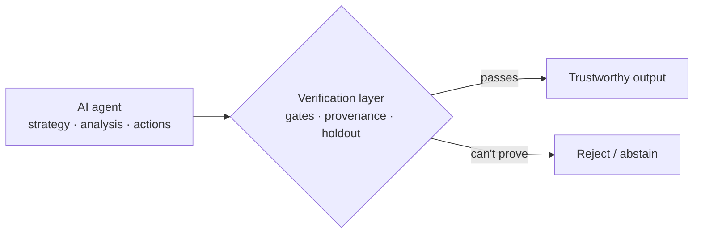

# CC Tsai

Final-year Mechanical Engineering student at **National Cheng Kung University**, moving into
research on **trustworthy AI agents for finance** — making AI-generated strategies and
analysis **reproducible, verifiable, and auditable**.

> The question I keep coming back to: when an AI can generate code, generate analysis, and
> even operate a system directly, **how do we confirm its output is trustworthy?** In finance
> this bites hard — a backtest that overstates performance, or an analysis that quietly
> invents a number, costs real money.

I work **agent-first**: I design the systems, specify the validation that decides
accept-or-reject, and judge the results; AI coding agents (Claude Code / Codex) do the
implementation. The part I care about — and want to research — is *the checking layer*.

### 🔬 Research direction

Trustworthy, auditable AI agents in quantitative finance, along two lines I'm prototyping:

- **Strategy trustworthiness** — can overfitting be caught reliably? Validation gates
  (trial registration · PBO · DSR · single-use holdout · no-look-ahead contract) against a
  naïve-backtest baseline.
- **Analysis faithfulness** — a retrieval finance agent with a *number-provenance verifier*:
  every figure must trace to a source, or the agent abstains. Evaluated against public
  benchmarks (FinanceBench, DocFinQA, FinBen, Finance Agent Benchmark).

### 🧪 Project testbeds

Research prototypes for the question above — built to be *evaluated*, not shipped:

- **[crypto-quant-signal](https://github.com/0Smallcat0/crypto-quant-signal)** — spot, long-only, public-data daily signals behind six validation gates, with a paper-trading scoreboard. Paper-only; never touches a live account.
- **[trialgate](https://github.com/0Smallcat0/trialgate)** — that validation gate extracted into a zero-dependency package on [PyPI](https://pypi.org/project/trialgate/) (trial registry · CSCV/PBO · DSR · single-use holdout): the working prototype of the “strategy trustworthiness” line above. It has already rejected one of my own strategies on a locked holdout.
- **[legal-agent](https://github.com/0Smallcat0/legal-agent)** — retrieval-first Taiwan legal assistant: five anti-hallucination gates + a time-sliced statute store that cites the law in force at the event's date. My deepest system-design work, and the seed of this research direction.
- **[otto](https://github.com/0Smallcat0/otto)** — a financial terminal an AI operates end-to-end over MCP, with hard paper/live safety isolation — a testbed for *auditable* agent-operated systems. [v1.0.0](https://github.com/0Smallcat0/otto/releases/tag/v1.0.0) ships a 20-task agent-operability benchmark graded programmatically (state assertions, artifacts, refusal-with-state-unchanged — no LLM judge): claude-sonnet-5 **20/20**, claude-haiku-4-5 **19/20**.
- **[report-workflow](https://github.com/0Smallcat0/report-workflow)** · **[OpenRead](https://github.com/0Smallcat0/OpenRead)** — deterministic source-to-DOCX reporting with traceable provenance; a bring-your-own-key web/PDF translation extension.

### 👋 About

Self-taught career-changer (mechanical engineering → AI / quant finance). Strong at
decomposing problems, prototyping fast with AI tooling, and validation / risk thinking;
seeking graduate research training to deepen the statistics and evaluation methodology
behind all of it. 中文（母語）· English (C1) · 日本語（基礎）.
