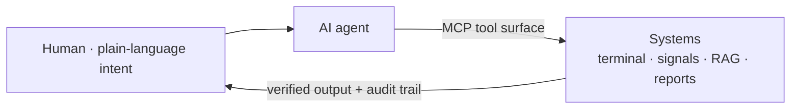

# 0Smallcat0

Quant & AI-systems engineer. I build data and AI systems whose outputs you can
actually **check** — the hard part is proving the thing works, not demoing that it runs.

I like building the boring, dependable plumbing that ambitious AI and trading systems
stand on: financial infrastructure, agent tooling, and trustworthy retrieval.

🧪 **1,000+ automated tests** &nbsp;·&nbsp; 📦 **5 shipped projects** &nbsp;·&nbsp; 🐍 **100k+ lines of Python** &nbsp;·&nbsp; ⚛️ TS / React frontends

**Core stack:** Python · FastAPI · TypeScript / React · LLM + RAG · MCP / agent tooling

- 🧪 **Tested to the hilt** — validation gates over vibes; every project ships with its own suite.
- 🛡️ **Overfitting & hallucination guards** built in, not bolted on (PBO / DSR / holdout; five-gate RAG).
- 🤖 **Agent-operated** systems — MCP tool surfaces and deterministic agent pipelines.

### 🔭 Currently building

- **otto** — a financial terminal an AI operates end-to-end over MCP; the human just watches the dashboard.
- **crypto-quant-signal** — honest daily crypto signals behind an anti-overfitting gate, with a paper-trading scoreboard.

### 📌 Featured projects

- **[crypto-quant-signal](https://github.com/0Smallcat0/crypto-quant-signal)** — crypto spot daily-signal system with an anti-overfitting validation gate (PBO / DSR / single-use holdout) and a paper scoreboard. Public data only, no API keys.
- **[otto](https://github.com/0Smallcat0/otto)** — local, AI-operated financial terminal (FastAPI + React + MCP), safety-gated and clean-room built.
- **[legal-agent](https://github.com/0Smallcat0/legal-agent)** — retrieval-first Taiwan legal assistant with a five-gate anti-hallucination pipeline.
- **[report-workflow](https://github.com/0Smallcat0/report-workflow)** — deterministic source-to-DOCX report pipeline for agent environments.
- **[OpenRead](https://github.com/0Smallcat0/OpenRead)** — transparent, "bring your own key" browser extension for web & PDF translation.

